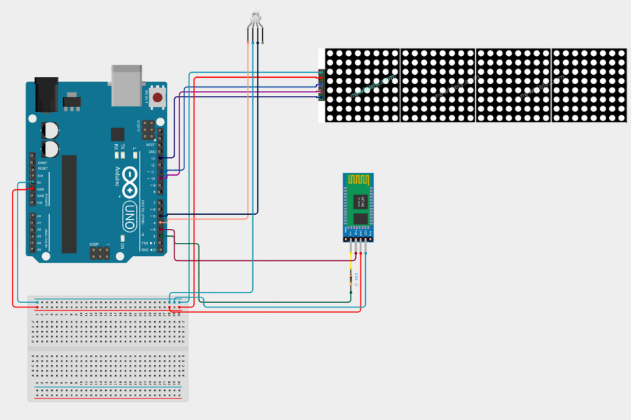
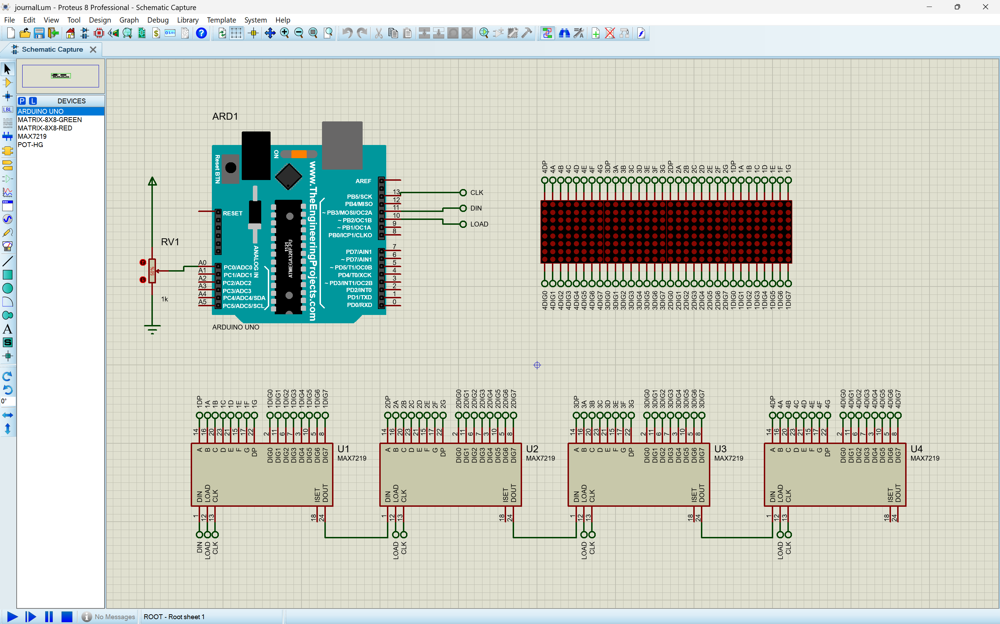
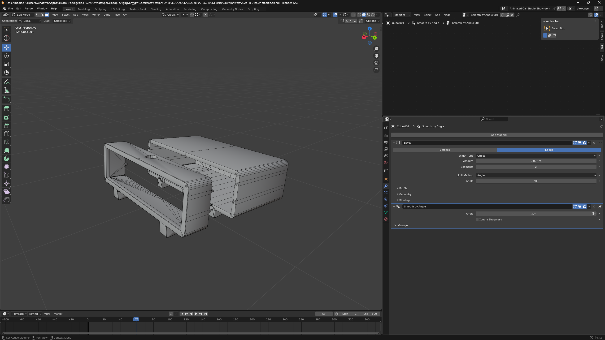

# Bluetooth-Controlled Scrolling LED Display (Journal Lumineux)

An embedded systems project built and programmed from scratch — a wireless scrolling LED display controlled in real time via Bluetooth, housed in a custom 3D-printed enclosure.

---

## Demo


---

## How It Works

A smartphone or PC sends a text message wirelessly over Bluetooth. The Arduino receives it, displays it as scrolling text on the LED matrix, and updates the RGB status LED. Scroll speed can be adjusted on the fly by sending `+` or `-` commands.

```
[ Phone / PC ]  --Bluetooth-->  [ HC-06 ]  -->  [ Arduino Uno ]  -->  [ 32x8 LED Matrix ]
                                                       |
                                                 [ RGB LED ]
                                              (status indicator)
```

---

## Hardware Components

| Component | Reference | Role |
|---|---|---|
| Arduino Uno | ATmega328P | Main microcontroller |
| LED Matrix 32×8 | NH1088AS (4× MAX7219) | Scrolling text display |
| Bluetooth Module | HC-06 (slave) | Wireless serial communication |
| RGB LED | Common anode, 5V | Status indicator |

---

## Wiring Diagram



---

## Circuit Schematic (Proteus ISIS)



> The full Proteus simulation file is available at `journalLumineux.pdsprj` — open it with Proteus ISIS to run the simulation.

---

## Enclosure Design (3D Modelling)

The enclosure was fully designed in **Blender 4.4** and 3D printed to house all components in a clean, stable casing.



> The Blender source file is available at `PrototypeDesign.blend`.

---

## Finished Prototype


---

## Features

- Send any text message wirelessly from a phone or laptop
- Real-time scrolling display on a 32×8 LED matrix
- Live speed control via `+` (faster) and `-` (slower) commands
- RGB LED status feedback: green = idle, red = receiving data
- Custom 3D-printed enclosure designed in Blender
- Default boot message: `"Pret !"`

---

## Tech Stack

- **Language:** C++ (Arduino)
- **Libraries:** MD_Parola, MD_MAX72xx, SoftwareSerial, SPI
- **Protocol:** UART over Bluetooth (HC-06, 9600 baud)
- **Hardware interface:** SPI (LED matrix), Software Serial (Bluetooth)
- **Simulation:** Proteus ISIS
- **3D Modelling:** Blender 4.4

---

## Getting Started

### Requirements
- Arduino IDE
- Libraries: `MD_Parola`, `MD_MAX72xx` (installable via Arduino Library Manager)
- Proteus ISIS (optional, to open the simulation file)
- Blender 4.4+ (optional, to open the enclosure design file)

### Upload & Use
1. Clone this repo and open `Journal_Lumineux_2ap.ino` in Arduino IDE
2. Install required libraries via Library Manager
3. Wire the components following `Cablage.png`
4. Upload to Arduino Uno
5. Pair your phone with the HC-06 module (default PIN: `1234`)
6. Use any Bluetooth serial terminal app to send messages or speed commands (`+` / `-` to adjust scroll speed)

---

## Project Context

Built as a 2ème année préparatoire engineering project at ISGA (2024–2025).  
Fully designed, programmed, wired, simulated, and physically assembled — including a custom 3D-printed enclosure. The prototype was tested end to end and confirmed working.

---

## License

MIT
